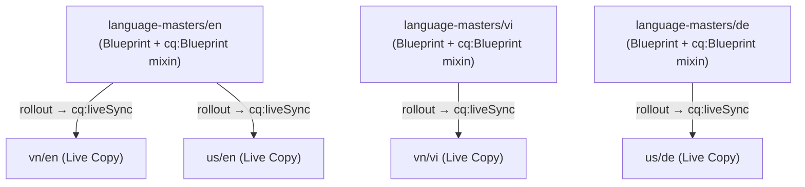

# MSM Setup for Newspaper Project

## Approach: Code-only via `ui.content` JCR XML

Yes, toàn bộ page structure và MSM relationship đều có thể định nghĩa bằng JCR XML trong `ui.content`. Khi Maven deploy package, AEM sẽ nhận ra Live Copy relationship thông qua mixin `cq:LiveSync` và node `cq:LiveSyncConfig` trên `jcr:content` của mỗi Live Copy page.



---

## Files to Create / Modify

### 1. New page tree in `ui.content/src/main/content/jcr_root/content/newspaper/`

**`language-masters/.content.xml`** — Folder page (no content, no publish):

```xml
<jcr:root ... jcr:primaryType="cq:Page">
  <jcr:content
      jcr:primaryType="cq:PageContent"
      jcr:title="Language Masters"
      sling:resourceType="newspaper/components/page"
      cq:template="/conf/newspaper/settings/wcm/templates/page-content"/>
</jcr:root>
```

**`language-masters/en/.content.xml`** — Blueprint EN, copy current `us/en` content here, add:
- `cq:language="en"` property
- Mixin `cq:Blueprint` on `jcr:content`

**`language-masters/vi/.content.xml`** — Blueprint VI (minimal, empty layout):
- `cq:language="vi"`
- Mixin `cq:Blueprint`

**`language-masters/de/.content.xml`** — Blueprint DE (minimal):
- `cq:language="de"`
- Mixin `cq:Blueprint`

---

**`vn/.content.xml`** — Region VN root (redirect to `vn/vi`)

**`vn/en/.content.xml`** — Live Copy of `language-masters/en`:

```xml
<jcr:root ... jcr:primaryType="cq:Page">
  <jcr:content
      jcr:primaryType="cq:PageContent"
      jcr:mixinTypes="[cq:LiveSync]"
      cq:language="en"
      jcr:title="en"
      sling:resourceType="newspaper/components/page"
      cq:template="/conf/newspaper/settings/wcm/templates/page-content">
    <cq:liveSync
        jcr:primaryType="cq:LiveSyncConfig"
        cq:master="/content/newspaper/language-masters/en"
        cq:isDeepCopy="{Boolean}true"
        cq:isCancelled="{Boolean}false"
        cq:rolloutConfigs="[/libs/msm/wcm/rolloutconfigs/default]"/>
  </jcr:content>
</jcr:root>
```

Same pattern for: `vn/vi`, `us/de` — chỉ thay `cq:master` và `cq:language`.

---

### 2. Modify existing files

**`us/en/.content.xml`** — Convert từ plain page thành Live Copy:
- Giữ nguyên `jcr:content` content (teasers, helloworld) — nó sẽ bị rollout ghi đè lần đầu
- Thêm `jcr:mixinTypes="[cq:LiveSync]"` + child `cq:liveSync` trỏ đến `language-masters/en`

**`us/.content.xml`** — Giữ nguyên redirect đến `us/en`

**`.content.xml`** (site root) — Giữ nguyên hoặc đổi redirect sang `us/en`; thêm note `language-masters` không publish

---

### 3. `META-INF/vault/filter.xml`

Filter hiện tại đã cover `/content/newspaper` với `mode="merge"` → **không cần thay đổi**. Tuy nhiên nếu muốn kiểm soát granular hơn (exclude `language-masters` khỏi publish replication agent filter), có thể thêm exclude rule.

---

### 4. OSGi Rollout Config (optional, ui.config)

Dùng built-in rollout config `/libs/msm/wcm/rolloutconfigs/default` là đủ cho mock project. Nếu muốn custom (ví dụ chỉ rollout content, không rollout structure), tạo thêm file trong `ui.config/src/main/content/jcr_root/apps/newspaper/osgiconfig/`:

```
com.day.cq.wcm.msm.impl.actions.ContentUpdateActionFactory~newspaper.cfg.json
```

Không bắt buộc ở phase này.

---

## Deployment Flow

```
mvn clean install -PautoInstallSinglePackage
```

Sau khi deploy:
1. Mở AEM Sites admin → `/content/newspaper/`
2. Verify `vn/en`, `vn/vi`, `us/en`, `us/de` có icon LiveCopy (chain-link)
3. Test: chỉnh sửa `language-masters/en` → Rollout → kiểm tra `vn/en` và `us/en` nhận update

---

## Lưu ý quan trọng

- `language-masters/` phải được **exclude khỏi Replication Agent** (không publish ra Publish instance) — config này nằm ở Replication Agent trên Author, không phải trong code
- Nội dung `us/en` hiện tại (teasers, helloworld) nên **migrate lên `language-masters/en`** — `us/en` trở thành Live Copy rỗng, nội dung đến từ rollout
- Mixin `cq:Blueprint` trên language master giúp AEM Sites UI hiển thị đúng blueprint icon và cho phép dùng Blueprint wizard
